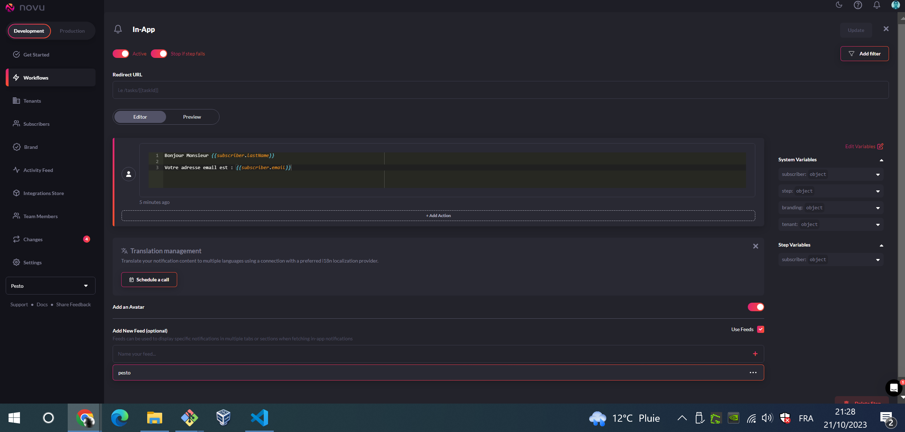

# The Novu POC


## The Novu Quickstart


### Step 0 prepare a frontend web project.

I started from a preact ts flowbite, with React compatibility based on `preact/compat`, instead of asimple `React`.

I then just added one dependency :

```bash
pnpm add --save @novu/notification-center
```

### Step 1: Create a Novu Account

Done by github OAuth2 login

### Step 2: Create a workflow

Before triggering a notification, we need to create a workflow.

The recipients of a triggered notification are called _**subscribers**_.

To create a workflow, you have perfectly documented steps at https://docs.novu.co/quickstarts/react#create-a-workflow

Here is how my Workflow looks:



### Step 3: Create a Subscriber

To create a Subscriber in `Novu`:

* we cannot create one using the WebUI
* we have to send an HTTP request to hit the Nova API, using for example the `@novu/node`, which sends the HTTP request using axios, see the below quote from stdout:

```bash
  headers: Object [AxiosHeaders] {
    date: 'Sat, 21 Oct 2023 21:27:25 GMT',
    'content-type': 'application/json; charset=utf-8',
    'content-length': '353',
    connection: 'close',
    'content-security-policy': "default-src 'self';base-uri 'self';font-src 'self' https: data:;form-action 'self';frame-ancestors 'self';img-src 'self' data:;object-src 'none';script-src 'self';script-src-attr 'none';style-src 'self' https: 'unsafe-inline';upgrade-insecure-requests",
    'cross-origin-embedder-policy': 'require-corp',
    'cross-origin-opener-policy': 'same-origin',
    'cross-origin-resource-policy': 'same-origin',
    'x-dns-prefetch-control': 'off',
    'x-frame-options': 'SAMEORIGIN',
    'strict-transport-security': 'max-age=15552000; includeSubDomains',
    'x-download-options': 'noopen',
    'x-content-type-options': 'nosniff',
    'origin-agent-cluster': '?1',
    'x-permitted-cross-domain-policies': 'none',
    'referrer-policy': 'no-referrer',
    'x-xss-protection': '0',
    vary: 'Origin, Accept-Encoding',
    etag: 'W/"161-KG0IxL2U/HoZgkxTR9bB7s6wVnw"'
  },
  config: {
    transitional: {
      silentJSONParsing: true,
      forcedJSONParsing: true,
      clarifyTimeoutError: false
    },
    adapter: [ 'xhr', 'http' ],
    transformRequest: [ [Function: transformRequest] ],
    transformResponse: [ [Function: transformResponse] ],
    timeout: 0,
    xsrfCookieName: 'XSRF-TOKEN',
    xsrfHeaderName: 'X-XSRF-TOKEN',
    maxContentLength: -1,
    maxBodyLength: -1,
    env: { FormData: [Function], Blob: [class Blob] },
    validateStatus: [Function: validateStatus],
    headers: Object [AxiosHeaders] {
      Accept: 'application/json, text/plain, */*',
      'Content-Type': 'application/json',
      Authorization: 'ApiKey MY_SECRET_API_KEY_IDONT_GIVE_IT',
      'User-Agent': 'axios/1.5.1',
      'Content-Length': '74',
      'Accept-Encoding': 'gzip, compress, deflate, br'
    },
    baseURL: 'https://api.novu.co/v1',
    method: 'post',
    url: '/subscribers',
    data: '{"subscriberId":"123ronsard","firstName":"De Ronsard","lastName":"Pierre"}'

```

* The exact request to send, to create a subscriber is (I tesed it, it does work):

```bash
export NOVU_API_KEY="9b670ccdf5b461907c630b10d02fea44"
export NOVU_SUBSCRIBER_FIRSTNAME="Alexandre"
export NOVU_SUBSCRIBER_LASTNAME="Dumas"
export NOVU_SUBSCRIBER_ID="568DumasPere"

curl -X POST \
     -H "Authorization: ApiKey ${NOVU_API_KEY}" \
     -H "Accept: application/json, text/plain, */*" \
     -H "Content-Type: application/json" \
     -d "{ \"subscriberId\": \"${NOVU_SUBSCRIBER_ID}\", \"firstName\": \"${NOVU_SUBSCRIBER_FIRSTNAME}\", \"lastName\": \"${NOVU_SUBSCRIBER_LASTNAME}\" }" \
     https://api.novu.co/v1/subscribers | tail -n 1 | jq .

```

* I created a script to automatically create the required subscriber :

```bash
export NOVU_API_KEY="b47c1478e7709259bf4a109538f5d3d6"
export NOVU_API_KEY="9b670ccdf5b461907c630b10d02fea44"
export NOVU_SUBSCRIBER_FIRSTNAME="Alexandre"
export NOVU_SUBSCRIBER_LASTNAME="Dumas"
export NOVU_SUBSCRIBER_ID="568DumasPere"

pnpm run terraform:novu
```

* then:

```bash
export NOVU_API_KEY="64aa077036bc79e3707157f391f05265"
export NOVU_TRIGGER_IDENTIFIER="pestonovuwf"
export NOVU_SUBSCRIBER_ID="568DumasPere"
export NOVU_TENANT_IDENTIFIER="pesto-poc-novu"
export NOVU_NOTIF_MSG="Oh wow I just sent a notification to novu :o "
pnpm run terraform:novu:notifictation:send

```
* same with a `curl` to send a notification : 

```bash
curl --location --request POST 'https://api.novu.co/v1/events/trigger' \
     --header 'Authorization: ApiKey <REPLACE_WITH_API_KEY>' \
     --header 'Content-Type: application/json' \
     --data-raw '{
         "name": "pestonovuwf",
         "to": {
           "subscriberId": "568DumasPere"
         },
         "payload": {
           "description": "Oh wow I just sent a notification to novu :o "
         },
         "tenant": null
       }'
```

```bash
    headers: Object [AxiosHeaders] {
      Accept: 'application/json, text/plain, */*',
      'Content-Type': 'application/json',
      Authorization: 'ApiKey 9b670ccdf5b461907c630b10d02fea44',
      'User-Agent': 'axios/1.5.1',
      'Content-Length': '147',
      'Accept-Encoding': 'gzip, compress, deflate, br'
    },
    baseURL: 'https://api.novu.co/v1',
    method: 'post',
    url: '/events/trigger',
    data: '{"name":"quickstart","to":{"subscriberId":"568DumasPere"},"payload":{"description":"Oh wow I just sent a notification to novu :o "},"overrides":{}}'

```

## Spin up


```bash
pnpm add -D tailwindcss postcss autoprefixer
# npx tailwindcss init -p
pnpm dlx  tailwindcss init -p

cat <<EOF >./tailwind.config.js
/** @type {import('tailwindcss').Config} */
export default {
  content: [
    './src/**/*.{js,jsx,ts,tsx}',
    'node_modules/flowbite-react/**/*.{js,jsx,ts,tsx}',
  ],
  theme: {
    extend: {},
  },
  plugins: [require('flowbite/plugin')],
}
EOF

cat << EOF>./src/index.addon.css
@tailwind base;
@tailwind components;
@tailwind utilities;
EOF

cp ./src/index.css ./src/index.previous.css

cat ./src/index.addon.css | tee ./src/index.css
cat ./src/index.previous.css | tee -a ./src/index.css

pnpm add --save flowbite flowbite-react


```


## References

* https://flowbite.com/docs/getting-started/react/
* https://flowbite.com/docs/getting-started/quickstart/#typescript
* https://flowbite.com/docs/getting-started/typescript/
* https://www.flowbite-react.com/